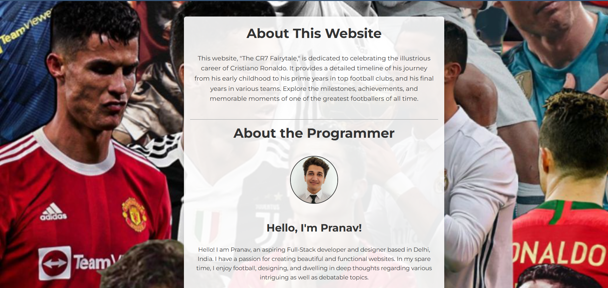

# Cristiano Ronaldo Timeline

This project is a dedicated fansite that chronicles the incredible career of Cristiano Ronaldo. It provides a detailed timeline of his journey, achievements, and memorable moments, complemented by interactive visualizations and a responsive design.

 <!-- Replace with the actual path to your image -->

---

## Features

- **Career Highlights**: A comprehensive timeline detailing Ronaldo's journey from his early days to his current career phase.
- **Interactive Statistics**: Dynamic and visually appealing charts showcasing his club and international career stats using [ApexCharts](https://apexcharts.com/).
- **Photo Gallery**: A horizontally scrollable gallery featuring Ronaldo's iconic moments.
- **Trophies and Achievements**: A list of trophies won, categorized by year and team.
- **Responsive Design**: Ensures seamless accessibility across devices.

---

## Technologies Used

- **Frontend**:
  - HTML5
  - CSS3
  - JavaScript (Vanilla JS + ApexCharts)
- **Styling**:
  - Responsive and minimalistic design using CSS
- **Hosting**:
  - GitHub Pages (optional, if hosted)

---

## Project Structure

```plaintext
📂 CR7 timeline
├── 📁 images                   # Folder for all images used in the project
├── 📂 main                     # Folder for main pages of the timeline
│   ├── childhood.html          # Page for Ronaldo's early childhood
│   ├── final.html              # Page for his final years in football
│   ├── intro.html              # Homepage for the timeline
│   ├── manu.html               # Page for his Manchester United era
│   └── rm.html                 # Page for his Real Madrid era
├── 📂 navigation               # Folder for additional pages and scripts
│   ├── about.html              # About the project and developer
│   ├── photogallery.css        # CSS for the photo gallery
│   ├── photogallery.html       # Photo gallery page
│   ├── photogallery.js         # JavaScript for photo gallery interactivity
│   ├── socials.html            # Social media links page
│   ├── stats.html              # Statistics page
│   └── stats.js                # JavaScript for charts and stats
└── README.md                   # Project documentation
